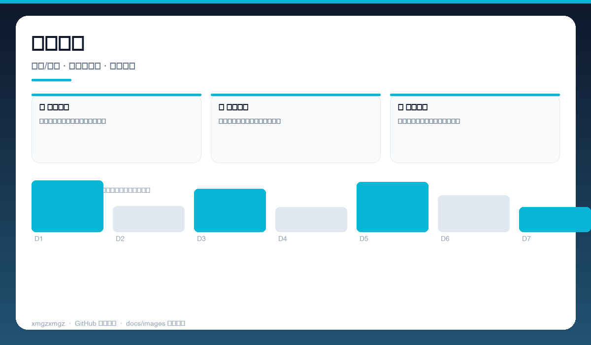
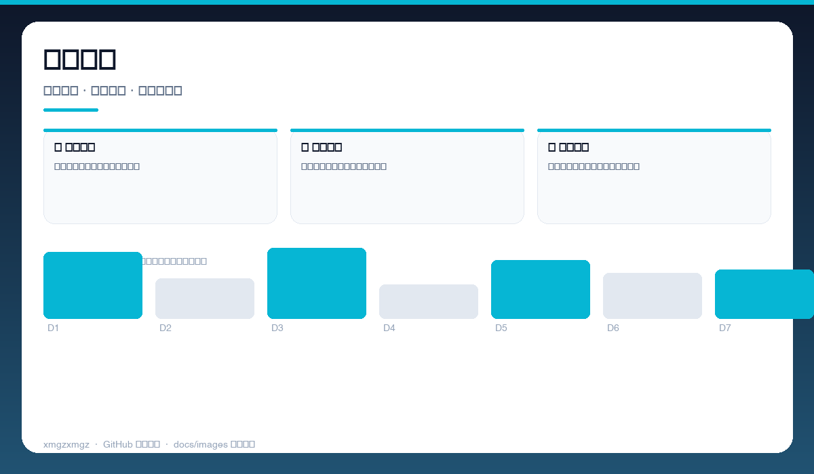
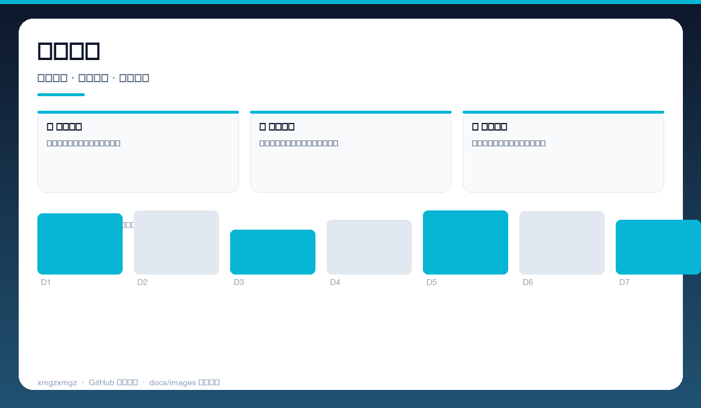

# 🐟 xianyuzhushou — xianyuzhushou

> 闲鱼卖家的效率工具 — 批量擦亮、上架与库存管理，自动跑。

[](https://github.com/xmgzxmgz/xianyuzhushou)
[](https://github.com/xmgzxmgz/xianyuzhushou/releases)
[](LICENSE)
[](https://github.com/xmgzxmgz/xianyuzhushou/actions/workflows/release.yml)

---

## ✨ 功能一览

| 模块 | 能力 | 状态 |
|------|------|------|
| ✨ 自动擦亮 | 定时批量擦亮，提升曝光无需手动 | ✅ |
| 📦 批量上架 | 模板化上架，库存与价格批量改 | ✅ |
| 📊 经营看板 | 商品状态、流量与成交一屏掌握 | ✅ |

---

## 📸 功能预览

> 以下为自动生成的示意预览（无需本地部署截图），展示核心功能形态。

| 总览 | 细节 | 流程 |
|------|------|------|
|  |  |  |
| 商品看板 · 在售/下架 · 曝光与浏览 · 批量操作 | 自动擦亮 · 定时任务 · 执行日志 · 成功率统计 | 批量上架 · 模板填充 · 价格库存 · 一键发布 |

<details>
<summary>查看大图</summary>


</details>

---

## 🚀 快速开始

```bash
./gradlew assembleDebug
# 安装 APK 后按引导授予无障碍/悬浮窗权限
```

---

## 🛠 技术栈

Kotlin · Android · Automation · E-commerce · Batch Ops

---

## 🗂️ 目录结构（节选）

```
xianyuzhushou/
├── docs/images/        # 本 README 的三张自动生成预览图
├── .github/workflows/  # Auto Release 自动发版
├── README.md
└── ...                 # 源码与配置
```

---

## 📦 Releases

本仓库已启用 **Auto Release**（`.github/workflows/release.yml`）：

- 推送 `v*` tag 自动发版：`git tag v0.2.0 && git push origin v0.2.0`
- 手动触发：`gh workflow run "Auto Release" -f version=v0.2.0`（留空则自动 patch +1）
- 变更说明自动生成（`--generate-notes`）

前往 [Releases](https://github.com/xmgzxmgz/xianyuzhushou/releases) 查看。

---

## 🙏 相关项目

- [workbuddy-account-hub](https://github.com/xmgzxmgz/workbuddy-account-hub) — WorkBuddy 账户中枢（本 README 的样板）
- 更多见 [xmgzxmgz 主页](https://github.com/xmgzxmgz)

---

## 许可

MIT
